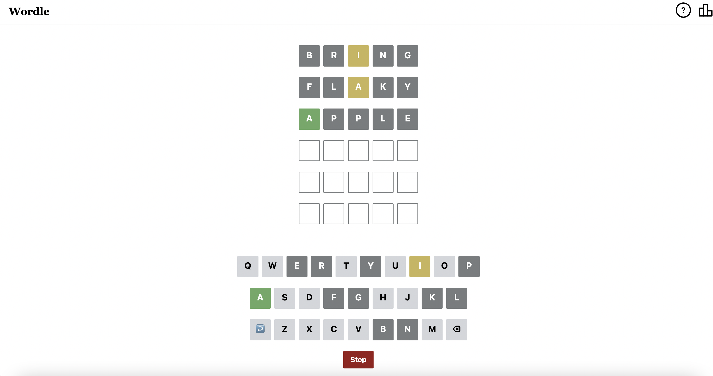
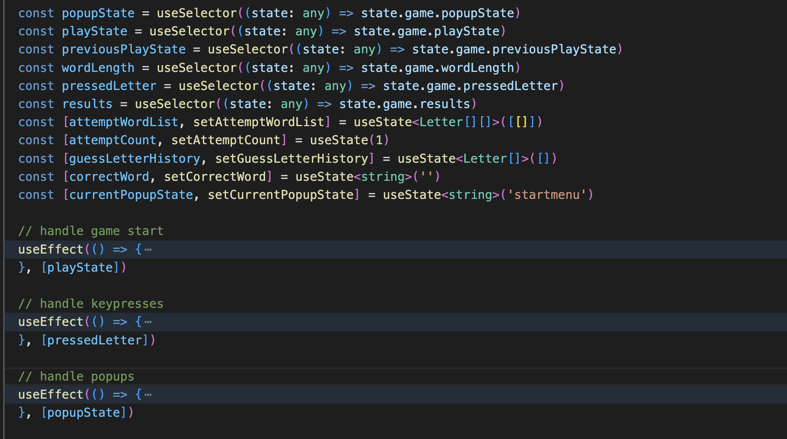
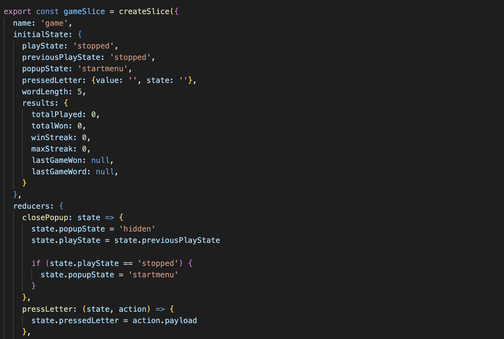
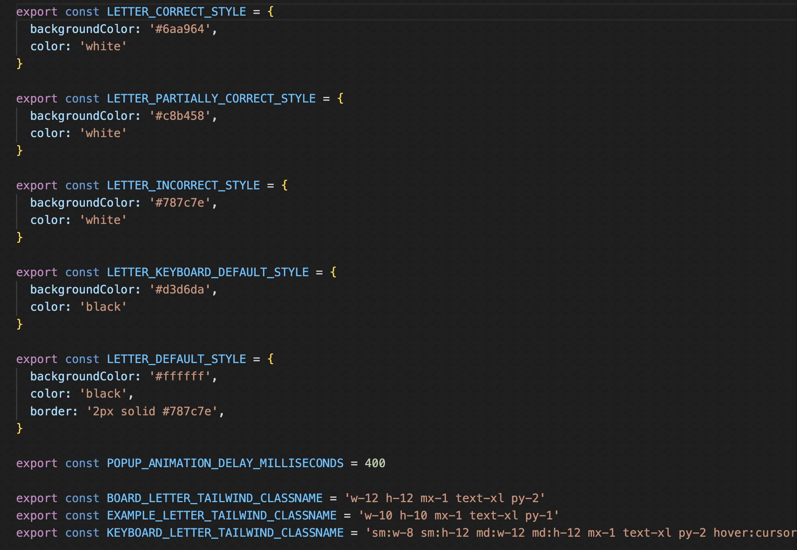

# Wordle App

# Overview

This document aims to present the planning that went behind building this app. The app is a clone of the game `Wordle`. The app contains frontend modules primarily. A mock backend has been made to simulate a ‘Words API’ that was required for this project.

**Deployed URL:** [https://wordle-svr8.vercel.app/](https://wordle-svr8.vercel.app/)

**********************Github:********************** [https://github.com/svr8/wordle](https://github.com/svr8/wordle)

********************Tech Stack:******************** React, NextJS

# Task Breakdown

The app comprises 4 major components that could be isolated and reused:

1. Letters: A row of letters
2. Keyboard: Alphabets with Backspace and Enter Keys
3. Game Board: Wordle-Word-Grid with Keyboard placed below the grid
4. Popup Dialog: A simple alert box with action buttons

These components were identified based on the nature of being independent, making it easy to plug and play with all the relevant UI configurations and DOM event handlers. For example:

- `Help` section uses `Letters` components to demonstrate various scenarios
- The `Keyboard` uses 3 `Letters` components

Similarly, a game like Quordle([https://www.merriam-webster.com/games/quordle/#/](https://www.merriam-webster.com/games/quordle/#/)) can be built by re-using these 4 components. These components are located in `/modules/game/components` directory.

There are some miscellaneous components that are specialized for this project. These components are placed in the`/components` directory.

# Key Problems Handled

## Making it re-usable: Separating the game logic from components

The idea is to keep the sub-components as independent as possible so they can be re-used in the future. This is why no logical decision was implemented inside the components placed in `modules` folder. The modules are treated as pre-packaged solutions that can be interfaced with easily, and configured using props.

.

This is why component events are listened to and handled in `/components/game.tsx` file. This file contains the core logic and implementation of all possible events occurring in the game.

## Making it simple: Designing one-way communication

`Redux` was used to manage the complexity of event passing between various levels of nested components. The project involved up to 3 levels of nesting between components and back-and-forth communication. This was solved by publishing data to a common store and each component implementing independent event handlers.

Efforts were made to keep all props passed to components to be one-way and remove all backward event handling and data propagation.

## Making it configurable: Keeping the styling Tailwind-based only

It was not completely possible to use Tailwind due to specialized requirements that make it look and feel like the original game. However, all style configurations are compiled into a single `/lib/game/config.ts` file that would make it easy to manage various constants of the game. All effort was done to use Tailwind and keep the components highly configurable.

Similarly, other `constants` files have been created related to various sections of the app, like, APIs. These steps make it easy to modify the app on the go.

# Conclusion

The app was built took 5 days to build completely and deploy it. It was a fun experience brainstorming and identifying breakpoints and trying to make the app scalable.